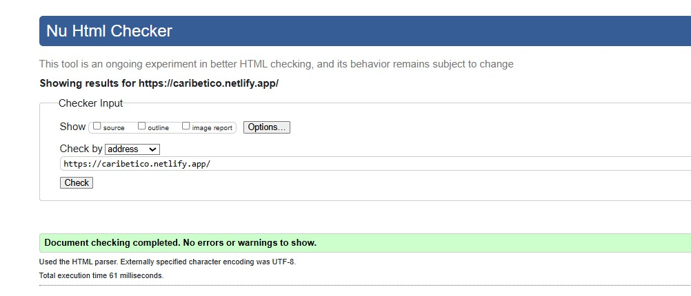
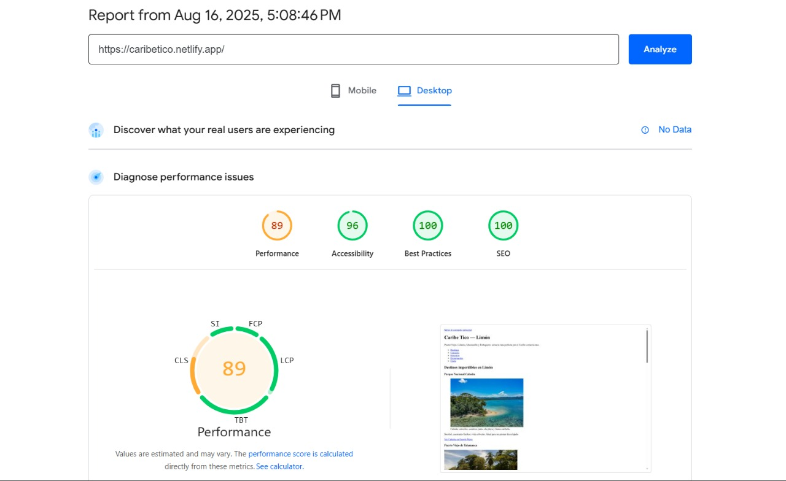
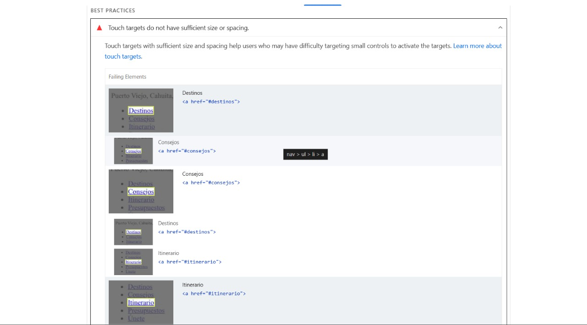

# Caribe Tico — Limón

Sitio informativo y promocional sobre turismo en **Limón, Costa Rica**. Incluye secciones de **destinos**, **consejos**, **itinerario**, **presupuestos** y un formulario para **unirte** al boletín.  
Objetivo: ofrecer una página **ligera, accesible y fácil de navegar** desde móvil y escritorio.

---

## 2) Estructura semántica

Etiquetas clave usadas y propósito (según el código enviado):

- `<!DOCTYPE html>` y `lang="es-CR"`: documento HTML5 y localización en español de Costa Rica.
- `<meta charset="UTF-8">`, `<meta name="viewport">`, `<meta name="description">`, `<link rel="canonical">`: metadatos de SEO y responsive.
- `a.skip-link`: **enlace de salto** para ir directo al contenido (`href="#contenido"`).
- `header` → `h1`, `p`, `nav[aria-label="Navegación principal"]` + `ul/li/a`: identidad del sitio y menú principal.
- `main#contenido`: único bloque de contenido principal.
- `section[aria-labelledby]` por cada tema: `#destinos`, `#consejos`, `#itinerario`, `#presupuestos`, `#registro`.
- `h2`/`h3`: jerarquía de títulos.  
- `article[aria-labelledby]`: tarjetas de cada destino.
- `figure` + `img[alt][loading="lazy"]` + `figcaption`: imágenes con pie descriptivo.
- Listas: `ul`/`ol` + `li` para checklist y pasos.
- Cita: `aside` + `blockquote`.
- Multimedia: `video[controls][aria-label]` (sección “Consejos en video”).
- Tablas con **accesibilidad**: `caption`, `thead/tbody`, `th[scope]` y `aria-describedby`.
- Formulario: `form` con `label[for]`/`input[id]`, `fieldset` + `legend`, `select`, `button[type="submit"]`.
- `footer` con `nav[aria-label="Navegación de pie de página"]` y enlaces internos/externos.

---

## 3) URL pública de Netlify

**https://caribetico.netlify.app/**

---

## 4) Validación W3C (Nu HTML Checker)

- **Resultado:** _Document checking completed. No errors or warnings to show._  
- **Qué se validó:** la página públicada no presentó errores.  
- **Captura:** 


---

## 5) Lighthouse (Desktop)

| Métrica           | Puntuación |
|-------------------|------------|
| **Performance**   | **89**     |
| **Accessibility** | **96**     |
| **Best Practices**| **100**    |
| **SEO**           | **100**    |

**Capturas:**



### Hallazgos clave
- **Touch targets do not have sufficient size or spacing** (objetivos táctiles pequeños o muy juntos) principalmente en enlaces del menú/índice (“Destinos”, “Consejos”, “Itinerario”, “Presupuestos”, “Únete”) y algunos controles.

### Plan de mejoras
1. **Aumentar área clicable y separación de enlaces del menú** (recomendación Utilizar css para ajustar ~44×44 px):
   ```css
   /* Navegación y enlaces de índice */
   nav a {
     display: inline-block;
     padding: 10px 14px;  /* ~44x44 px táctiles */
     min-width: 44px;
     min-height: 44px;
     margin: 4px 6px;     /* separación entre enlaces */
     line-height: 1.2;
   }

   /* Indicador de foco visible para teclado */
   a:focus-visible,
   button:focus-visible {
     outline: 2px solid currentColor;
     outline-offset: 2px;
   }

## 6) Accesibilidad aplicada: dónde y por qué usé `tabindex`, `aria-*`, `alt` y enlaces descriptivos

### `tabindex`
- `a.skip-link[tabindex="0"]` → hace **enfocable** el enlace “Saltar al contenido principal”, permitiendo a usuarios de teclado saltar la cabecera e ir directo a `#contenido`.
- `` → se dejó enfocable para poder llegar con TAB a la **figura** y leer el `figcaption`. **Mejora recomendada:** cambiar a `tabindex="-1"` (o quitarlo) para evitar una parada extra en la tabulación.
- `` → permite **enfoque programático** (por scripts o al aterrizar desde un ancla) **sin** entrar al orden de tabulación.

> Nota: los encabezados de destino (`h2`) pueden llevar `tabindex="-1"` si se quiere que reciban foco al navegar por anclas sin sumar paradas al TAB.

### `aria-*`
- `nav aria-label="Navegación principal"` y `nav aria-label="Navegación de pie de página"` → nombran cada región de navegación para lectores de pantalla.
- `section aria-labelledby="tit-*"` → cada sección toma como **nombre accesible** su `h2` correspondiente (ej.: `#destinos`, `#consejos`, `#itinerario`, `#presupuestos`, `#registro`).
- `article aria-labelledby="art-*-tit"` → cada destino usa su `h3` como nombre accesible del artículo.
- `video aria-label="Video con consejos para moverte en Limón"` → proporciona nombre accesible al reproductor (además se prevé pista de subtítulos).
- `table aria-describedby="desc-itinerario"` y `table aria-describedby="desc-presupuesto"` → vinculan cada tabla con su `caption`, dando **contexto** a usuarios de AT.
- `input#correo aria-describedby="help-correo"` → asocia la ayuda contextual con el control del correo.

### `alt` en imágenes
- Todas las `img` incluyen `alt` **descriptivo y específico** (p. ej., “Sendero costero… en Cahuita”, “Bicicletas frente a la playa de Puerto Viejo…”, “Canales selváticos de Tortuguero…”).  
  Esto permite comprender el contenido cuando la imagen no se ve o se usa lector de pantalla.

### Enlaces descriptivos
- Textos de enlace que **describen el destino de la acción**:  
  - “**Ver Cahuita en Google Maps**”,  
  - “**Ver mapa de Limón en Google Maps**”,  
  - “**Volver al inicio**”.
- Enlaces externos abiertos en pestaña nueva con `target="_blank"` usan `rel="noopener noreferrer"` por **seguridad** y rendimiento.
